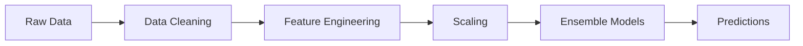

<p align="center">
  
  
  
  
</p>

<h1 align="center">🏗️ Concrete Compressive Strength Predictor</h1>

<p align="center">
  <strong>A Machine Learning-Powered Tool for Predicting Concrete Compressive Strength</strong><br>
  <em>CE 612: Machine Learning in Civil Engineering | NJIT</em>
</p>

---

## 📋 Overview

This project presents an **advanced ensemble machine learning system** for predicting the compressive strength of concrete based on its mix design. The model supports both **Normal Concrete** and **Ultra-High Performance Concrete (UHPC)** formulations, making it one of the most comprehensive concrete strength prediction tools available.

### ✨ Key Features

- 🎯 **High Accuracy Predictions** — Ensemble learning approach combining multiple models for robust predictions
- 🔬 **Dual Concrete Support** — Handles both Normal Concrete (30-60 MPa) and UHPC (110-200+ MPa)
- 🌐 **Interactive Web Interface** — User-friendly Streamlit application for real-time predictions
- 📊 **14 Input Parameters** — Comprehensive mix design inputs including supplementary cementitious materials
- ⚡ **Real-time Results** — Instant predictions with a clean, modern interface

---

## 🔬 Technical Highlights

### Dataset
- **1,841 concrete mix samples** from multiple sources
- **20 features** including cement, slag, fly ash, water, superplasticizer, aggregates, and specialty additives
- Comprehensive coverage of concrete types from conventional to ultra-high performance

### Machine Learning Pipeline



1. **Data Preprocessing**
   - Missing value imputation
   - Existence flag generation for specialty materials
   - Type encoding (Normal Concrete vs UHPC)

2. **Feature Engineering**
   - Binary existence indicators for 7 supplementary materials
   - Standardized scaling for optimal model performance

3. **Ensemble Learning**
   - Multiple base models combined for improved prediction accuracy
   - Cross-validated hyperparameter optimization

### Input Features

| Category | Features |
|----------|----------|
| **Base Materials** | Cement, Blast Furnace Slag, Fly Ash, Water, Superplasticizer, Coarse Aggregate, Fine Aggregate |
| **Supplementary Materials** | Slag, Silica Fume, Limestone Powder, Quartz Powder, Nano Silica, Fiber |
| **Properties** | Age (days), Concrete Type |

---

## 🚀 Quick Start

### Prerequisites

```bash
pip install streamlit pandas numpy scikit-learn joblib openpyxl
```

### Running the Application

```bash
streamlit run app.py
```

Navigate to `http://localhost:8501` in your browser to access the prediction interface.

---

## 📁 Project Structure

```
├── app.py                      # Streamlit web application
├── model_store.py              # Model loading and prediction functions
├── modeling.ipynb              # Complete ML pipeline (training & evaluation)
├── UPHC_concrete_data.xlsx     # Training dataset
├── final_ensemble_models.pkl   # Trained ensemble models
├── final_scaler.pkl            # Feature scaler
├── feature_columns.pkl         # Feature column ordering
└── README.md                   # Project documentation
```

---

## 🎮 Usage Guide

### Web Interface

1. **Launch the application** using `streamlit run app.py`
2. **Enter mix design parameters** in the left and right columns:
   - Base materials (Cement, Water, Aggregates, etc.)
   - Supplementary materials (Slag, Silica Fume, Nano Silica, etc.)
3. **Select concrete type** (Normal Concrete or UHPC)
4. **Click "Predict Compressive Strength"** to get the estimated strength in MPa

### Programmatic Usage

```python
from model_store import predict_strength, feature_columns
import pandas as pd

# Create input dataframe
mix_design = pd.DataFrame([{
    'Cement': 450,
    'Blast_Furnace_Slag': 0,
    'Fly_Ash': 50,
    'Water': 180,
    'Superplasticizer': 5,
    'Coarse_Aggregate': 1000,
    'Fine_Aggregate': 700,
    'Age': 28,
    'Slag': 0,
    'Silica_Fume': 0,
    'Limestone_Powder': 0,
    'Quartz_Powder': 0,
    'Nano_Silica': 0,
    'Fiber': 0,
    'TypeCode': 0  # 0 = Normal Concrete, 1 = UHPC
}])

# Generate existence flags
for material in ['Slag', 'Silica_Fume', 'Limestone_Powder', 'Quartz_Powder', 
                 'Nano_Silica', 'Fiber', 'Blast_Furnace_Slag']:
    mix_design[f'{material}_Exists'] = 1 if mix_design[material].iloc[0] > 0 else 0

# Predict strength
predicted_strength = predict_strength(mix_design)
print(f"Predicted Compressive Strength: {predicted_strength[0]:.2f} MPa")
```

---

## 📊 Model Performance

The ensemble model demonstrates excellent predictive capabilities across the full range of concrete strengths:

| Metric | Performance |
|--------|-------------|
| Coverage | 2 - 200+ MPa |
| Normal Concrete Range | 30 - 60 MPa |
| UHPC Range | 110 - 200+ MPa |

---

## 🔮 Input Parameter Ranges

| Parameter | Unit | Typical Range |
|-----------|------|---------------|
| Cement | kg/m³ | 200 - 800 |
| Water | kg/m³ | 120 - 250 |
| Superplasticizer | kg/m³ | 0 - 30 |
| Coarse Aggregate | kg/m³ | 600 - 1200 |
| Fine Aggregate | kg/m³ | 400 - 900 |
| Age | days | 1 - 365 |

---

## 🧪 Exploratory Analysis Highlights

### Strength Distribution

The dataset exhibits a **bimodal distribution** reflecting the two concrete types:
- Normal Concrete peaks around **30-60 MPa**
- UHPC peaks around **110-150 MPa** with a long tail extending to **200+ MPa**

### Key Correlations

- **Age** positively correlates with strength development
- **Water-Cement ratio** inversely affects compressive strength
- **Specialty additives** (Nano Silica, Silica Fume) significantly boost UHPC performance

---

## 🏆 Acknowledgments

- **Course**: CE 612 - Machine Learning in Civil Engineering
- **Institution**: New Jersey Institute of Technology (NJIT)
- **Data Sources**: Combined dataset of Normal Concrete and UHPC formulations

---

## 📜 License

This project is developed for academic purposes as part of the CE 612 course curriculum.

---

<p align="center">
  <em>Built with ❤️ for advancing concrete technology through machine learning</em>
</p>
